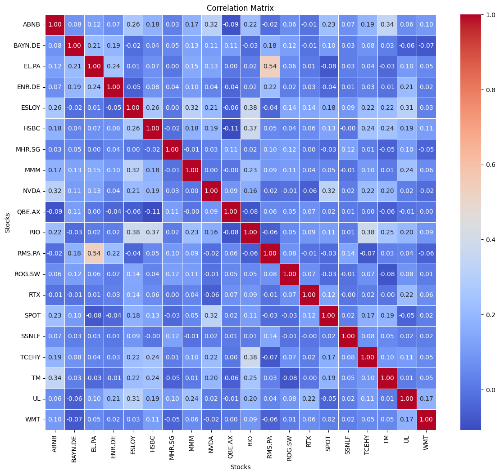

# PortfolioBuilder


## Overview

**PortfolioBuilder** is a powerful tool designed to help investors construct optimal portfolios by analyzing stock information. Utilizing data from the [yfinance](https://pypi.org/project/yfinance/) package, this tool enables users to gather stock data for a specified range and compute returns, ultimately assisting in identifying companies that are suitable for portfolio inclusion based on correlation analysis.

## Features

- **Data Gathering**: Retrieve stock data for selected companies using the yfinance package.
- **Customizable Time Range**: Specify a date range with a daily time interval for data collection.
- **Return Calculation**: Compute the daily returns for each company based on closing values.
- **Correlation Analysis**: Generate a correlation matrix to identify relationships between companies.
- **Portfolio Optimization**: Exclude highly correlated companies to minimize risk and enhance diversification.

## Installation

To use PortfolioBuilder, follow these simple steps:

1. **Clone the repository:** Navigate to your desired directory in your terminal and run the following command:

   `https://github.com/MauroAndretta/PortfolioBuilder.git`

   Then, change into the directory by executing: 

   `cd PortfolioBuilder`

2. **Install the required packages:** Ensure you have Python 3.7+ installed. Then, install the necessary packages by running:

   `pip install -r requirements.txt`

or using the dedicated conda environment going first the appropiate `conda` folder: 

```bash
conda env create --name notebooks_portfolio_builder --file=notebooks_portfolio_builder.yml
```

## Usage

Here's a step-by-step guide to using PortfolioBuilder:

1. **Prepare your list of companies:** Create a list in the `PortfolioBuilder.ipynb` the stock ticker symbols.

2. **Run the tool:** Execute the main `PortfolioBuilder.ipynb` with your desired parameters. 

   - **start-date** and **end-date**: Define the time range for data collection.

   - **range_analysis** : Define the time range for data analysis. The valid options are: `1d, 5d, 1mo, 3mo, 6mo, 1y, 2y, 5y, 10y, ytd, max`

   - **companies**: List the ticker symbols of companies you wish to include.

```python
tickers = ["TCEHY", "HSBC", "RTX", "ROG.SW", "SSNLF", "TM", "UL", "NVDA", 
           "QBE.  AX", "RIO", "MHR.SG", "RMS.PA", "ESLOY", "SPOT", "WMT", 
           "ENR.DE", "ABNB", "BAYN.DE", "MMM", "EL.PA", "AMZN"]
```


3. **Analyze the results:** Review the generated **correlation matrix** and identify suitable companies for your portfolio.


## Sample Output

- ### **Correlation Matrix:**





## Contributing

Contributions are welcome!

## License

This project is licensed under the MIT License - see the [LICENSE](LICENSE) file for details.

## Support

If you encounter any issues or have questions, feel free to open an issue on GitHub or contact me at [mauo.andretta222@gmail.com](mauo.andretta222@gmail.com).

## Acknowledgments

- Special thanks to the contributors of the [yfinance](https://github.com/ranaroussi/yfinance) package.
- Inspired by various portfolio optimization techniques and financial analysis tools.

## Follow Us

Stay updated with our latest developments:

- [LinkedIn](https://www.linkedin.com/in/mauro-andretta-61b179227)
- [GitHub](https://github.com/MauroAndretta)

---


